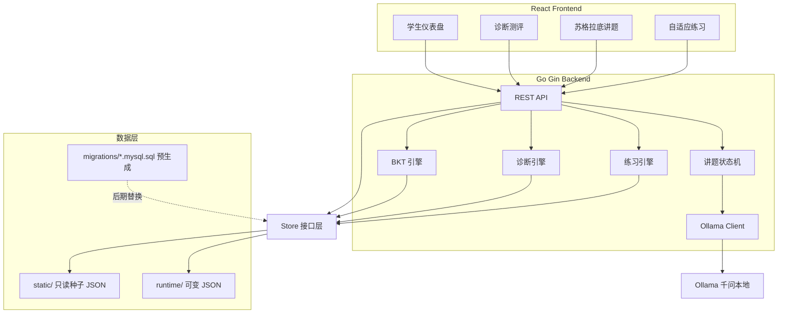
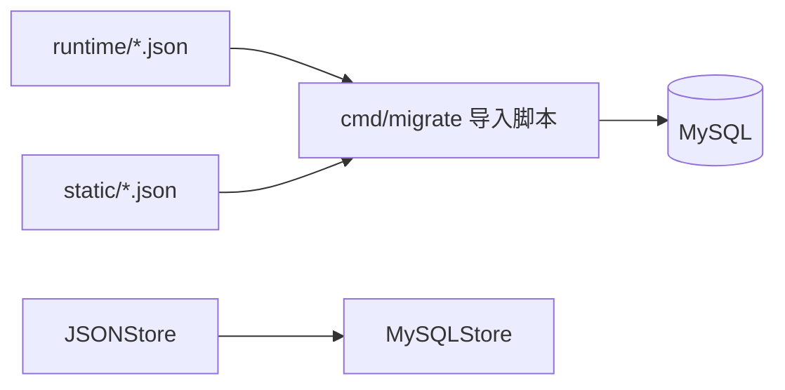
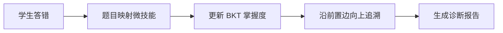

# 小学数学 AI 教育 MVP 设计方案

## 文章核心提炼

文章的本质论点是：**AI 教育的壁垒不在大模型参数，而在三层系统工程是否跑通闭环**。

| 层级 | 教育本质 | 文章要求 | MVP 可落地简化 |
|------|----------|----------|----------------|
| 诊断 | 知道哪里不会 | 微技能图谱 + GKT/BKT 知识追踪 | JSON 知识图谱 + 纯 Go 实现简化 BKT |
| 教学 | 用听得懂的方式讲明白 | 苏格拉底引导 + 多 Agent + 符号引擎 | Ollama 千问 + 强 Prompt 护栏 + 讲题状态机 |
| 练习 | 确保学会且不忘 | 最近发展区 + 间隔重复 + 行为分析 | 掌握度驱动推题 + 简化 SRS 复习调度 |

三个商业闭环在 MVP 中的映射：
- **结构化内容闭环**：用可视化知识图谱 + 题目微技能打标证明「有原油」
- **跨模态工程闭环**：MVP 暂不做拍照识题，用文字/公式题 + 后端符号验算兜底正确性
- **数据与评测闭环**：记录每次作答与掌握度变化，展示「练习前后雷达图对比」（为后续 RCT 积累数据）

---

## MVP 范围边界

**做深一个单元，不做宽覆盖。**

- 年级：小学 4-5 年级
- 单元：**分数的认识与运算**（与文章「分数通分漏洞导致后续全错」案例一致）
- 微技能：约 **18 个节点**，带前置依赖边
- 题库：**60 道题**，每题绑定 1-2 个微技能 + 难度 1-5
- 用户：单设备多学生档案（无需登录系统，降低 MVP 复杂度）

**明确不做（但预留接口）：**
- 拍照 OMR / 几何符号引擎
- 多 Agent 对抗架构（用 Prompt + Go 端答案校验替代）
- 全量 GKT 深度学习模型
- 教师端完整 SaaS

---

## 系统架构



**关键设计原则：**
- 诊断和练习不依赖 LLM（保证稳定性和可复现），LLM 仅用于教学层的引导对话
- **存储分层**：MVP 阶段用 JSON 文件跑通三层闭环；Store 接口与表结构一一对应，后期换 MySQL 只改实现，不改业务逻辑

---

## 数据存储策略：JSON 先行，MySQL 预留

### 为什么先用 JSON

- 零依赖启动，本地改数据直接看效果，最快验证「诊断 → 教学 → 练习」闭环
- 内容与运行时数据分离，方便手工调试 BKT 掌握度变化
- 表结构提前设计好并落成 SQL 文件，避免后期大改

### JSON 文件布局（对应每张表）

```
backend/data/
├── static/                    # 只读种子，启动时加载
│   ├── skills.json            # ↔ skills + skill_prerequisites
│   └── questions.json         # ↔ questions + question_skills
└── runtime/                   # 可变数据，每次写操作后落盘（.gitignore）
    ├── students.json          # ↔ students
    ├── mastery_states.json    # ↔ mastery_states
    ├── attempts.json          # ↔ attempts
    ├── review_schedule.json   # ↔ review_schedule
    └── tutor_sessions.json    # ↔ tutor_sessions
```

`skills.json` 内嵌 `prerequisites` 数组；`questions.json` 内嵌 `skills[]` 权重——减少文件碎片，逻辑上仍对应规范化表结构。

### Store 接口抽象（换库零侵入）

在 [`backend/internal/store/`](backend/internal/store/) 定义接口，业务层只依赖接口：

```go
type Store interface {
    // 静态内容（只读）
    ListSkills() ([]Skill, error)
    ListQuestions() ([]Question, error)

    // 学生
    CreateStudent(s Student) error
    GetStudent(id string) (*Student, error)

    // 掌握度 / 作答 / 复习 / 讲题会话
    GetMastery(studentID, skillID string) (*MasteryState, error)
    UpsertMastery(state MasteryState) error
    SaveAttempt(a Attempt) error
    ListAttempts(studentID string, since time.Time) ([]Attempt, error)
    // ... 其余与表一一对应
}
```

- **MVP 实现**：`JSONStore`（读写 `runtime/*.json`，启动时加载 `static/`）
- **后期实现**：`MySQLStore`（GORM 或 database/sql），实现同一接口

通过环境变量切换：`STORAGE=json`（默认） / `STORAGE=mysql`。

### 预生成 MySQL 建表 SQL

在 [`backend/migrations/001_schema.mysql.sql`](backend/migrations/001_schema.mysql.sql) 提前写好完整 DDL，MVP 阶段**不连接数据库**，但表设计与 JSON 字段完全对齐：

```sql
-- 示例结构，实施时生成完整文件
CREATE TABLE students (
    id         VARCHAR(36) PRIMARY KEY,
    name       VARCHAR(64) NOT NULL,
    grade      TINYINT NOT NULL,
    created_at DATETIME NOT NULL DEFAULT CURRENT_TIMESTAMP
);

CREATE TABLE mastery_states (
    student_id VARCHAR(36) NOT NULL,
    skill_id   VARCHAR(32) NOT NULL,
    p_known    DECIMAL(5,4) NOT NULL DEFAULT 0.5000,
    updated_at DATETIME NOT NULL,
    PRIMARY KEY (student_id, skill_id),
    FOREIGN KEY (student_id) REFERENCES students(id)
);
-- ... 其余 6 张表同理
```

可选 [`backend/migrations/002_seed.mysql.sql`](backend/migrations/002_seed.mysql.sql)：从 `static/*.json` 导出的 INSERT 语句，切换 MySQL 时一键导入种子数据。

### JSON → MySQL 迁移路径（后期 Phase 5）



1. 执行 `001_schema.mysql.sql` 建库建表
2. 运行 `go run cmd/migrate/main.go` 将现有 JSON 数据导入 MySQL
3. 改 `STORAGE=mysql`，重启服务——API 与前端无感知

---

## 第一层：诊断模块

### 微技能知识图谱（种子数据）

在 [`backend/data/skills.json`](backend/data/skills.json) 中定义有向无环图，示例节点：

```
认识分数 → 分数与除法 → 真分数假分数 → 通分 → 异分母比较
                                    ↘ 异分母加法 → 异分母减法
通分 → 同分母加法 → 同分母减法
```

每个节点字段：`id`, `name`, `grade`, `description`, `prerequisites[]`

「一元一次方程 17 微技能」的精神体现在：**「通分」不只是一个点，而是拆成「找公分母」「分子扩分」「比较扩分后分子」等子技能**。

### 简化 BKT 模型（Go 实现，借鉴 pyBKT / OATutor）

在 [`backend/internal/bkt/`](backend/internal/bkt/) 实现经典 4 参数 BKT，每个学生 × 每个微技能维护：

- `p_known`：当前掌握概率
- 全局默认：`p_learn=0.2`, `p_guess=0.2`, `p_slip=0.1`

每次作答后贝叶斯更新。这比文章说的 GKT 简单，但足以演示「做错一题 → 掌握度从 72% 降到 41% → 追溯到前置技能通分只有 28%」的核心体验。

**开源借鉴（保留 Go 自建，不引入 Python 依赖）：**

- **参数与更新公式对齐 [pyBKT](https://github.com/CAHLR/pyBKT)（MIT）**：用其经典 4 参数定义作为唯一真相源，Go 实现完成后用 pyBKT 跑同一组作答序列做离线交叉验证，确保掌握度曲线算得对。
- **可选 BKT+Forgets 变体**：pyBKT 支持「遗忘率 `p_forget`」，对应你练习层的间隔重复——技能长期不复习时 `p_known` 缓慢回落，与 SRS 调度天然耦合。MVP 可先用 `p_forget=0`，预留字段后期开启。
- **skillModel 结构借鉴 [OATutor](https://github.com/CAHLR/OATutor)（MIT）**：其 `skillModel.json` 把「题目 ↔ 微技能」做成集中映射表。你的 `questions.json` 的 `skills[]` 权重字段直接对齐此结构，便于后期自适应选题复用同一份技能模型。

### 诊断引擎

[`backend/internal/diagnose/`](backend/internal/diagnose/) 逻辑：

1. 初始诊断：从题库中按技能覆盖选取 12 题（覆盖所有一级技能）
2. 错题归因：题目 → `question_skills` 映射 → 更新 BKT → 若技能掌握度低，**沿 prerequisites 向上追溯**，标记根因
3. 输出诊断报告：
   - 技能雷达图数据
   - Top 3 薄弱技能
   - 根因链（如：「异分母加法 35% ← 通分 28% ← 最小公倍数 31%」）



---

## 第二层：教学模块

### 苏格拉底讲题状态机（借鉴 SocraticMATH 四阶段策略）

[`backend/internal/tutor/`](backend/internal/tutor/) 维护会话状态。状态划分直接采用 [ECNU-ICALK/SocraticMath](https://github.com/ECNU-ICALK/SocraticMath)（CIKM 2024，论文+数据集，与本项目同为 **Qwen/千问** 基座、且数据集覆盖小学**分数**知识点）验证过的四阶段对话策略：

```
INIT → REVIEW（回顾已知/澄清题意）
     → HEURISTIC（启发式提问，引导学生自己迈出下一步）
     → WAIT_STUDENT（等待作答）
     → RECTIFICATION（纠错：发现错误时不直接给答案，而是反问暴露错误前提）
     → SUMMARIZATION（总结归纳，回扣薄弱微技能）
     → DONE
```

每个状态有明确约束，通过 System Prompt 注入 Ollama：

- **禁止**：直接输出最终数值答案、使用超纲方法（如方程设元解小学题）
- **必须**：每次只问一个问题、用小学语言、结合当前薄弱技能给提示
- **上下文注入**：题目文本、正确解法步骤（来自题库结构化解析，非 LLM 生成）、学生薄弱技能、当前对话轮次

**借鉴方式（保留 Go + Ollama，不引入其微调模型）：**

- 把 SocraticMATH 的 **review → heuristic → rectification → summarization** 阶段策略与每阶段的 system prompt 模板，翻译成中文 prompt 写入 [`backend/internal/tutor/prompts/`](backend/internal/tutor/)，作为状态机各状态的护栏。
- **许可证注意**：SocraticMATH 代码为 MIT、**数据集为 CC BY-NC 4.0（仅限非商用）**。MVP 阶段只借鉴其 prompt 结构与对话策略（思想，非数据），不直接打包其对话数据；若将来商用需重新评估。
- 其 base model 是 Qwen1.5-7B，与你 Ollama 的 `qwen2.5:7b` 同源，prompt 风格迁移成本低；如效果不足，后期可考虑用其开源数据离线 LoRA 微调一个本地小模型（非商用前提下）。

### Ollama 集成

- 端点：`http://localhost:11434/api/chat`
- 推荐模型：`qwen2.5:7b` 或 `qwen2.5:3b`（本地可跑）
- Go 端用 **SSE 流式转发** 到 React，目标首字延迟 < 3 秒
- **降级策略**：Ollama 不可用时，回退到题库里预置的分步提示模板（[`questions.json` 中的 `hints[]`](backend/data/questions.json)）

### 答案校验（符号兜底，借鉴 mathtutor-on-groq 的「先算后讲」）

Go 端用 [`backend/internal/mathcheck/`](backend/internal/mathcheck/) 做确定性验算（分数通分、四则运算），不依赖 LLM 判断对错。LLM 只负责「引导」，对错由后端判定。

这一思路与 [bklieger-groq/mathtutor-on-groq](https://github.com/bklieger-groq/mathtutor-on-groq)（244⭐，Apache-2.0）一致：**先用确定性数学引擎解出答案/步骤，再把结果作为 context 注入 LLM**，从而避免 LLM 算错误导学生。实现要点：`mathcheck` 不仅判对错，还输出结构化的「正确分步解」，连同题目一起进 tutor 状态机的 context，让 Ollama 只做语言引导、不做计算。

---

## 第三层：练习模块

### 自适应推题算法（借鉴 OATutor 自适应选题）

[`backend/internal/practice/`](backend/internal/practice/) 选题优先级：

1. **到期复习题**（间隔重复调度，见下）
2. **掌握度 < 0.5 的薄弱技能**（优先根因技能）
3. **最近发展区**：选择预测正确率 60%-75% 难度的题（用 `p_known` 与题目 `difficulty` 匹配）

选题启发式直接对齐 [OATutor](https://github.com/CAHLR/OATutor)（MIT）的 *adaptive item selection*：**隔离单个最薄弱技能逐一攻克**（isolate skills to master individually），而非同时铺开多个技能，降低小学生认知负荷。

### 间隔重复（SRS）：直接引入 go-fsrs 官方库

不再手写「1/3/7 天」固定阶梯，改用 [open-spaced-repetition/go-fsrs](https://github.com/open-spaced-repetition/go-fsrs)（FSRS 算法的**官方 Go 实现**，可直接 `go get`，语言栈完全匹配）：

- FSRS 基于「难度 Difficulty + 稳定性 Stability + 可提取性 Retrievability」三变量建模，按「预测回忆概率跌到目标保留率（如 90%）」的时刻动态排期，比固定阶梯准确得多（官方基准比 SM-2 少约 20-30% 复习量）。
- 集成方式：技能掌握度首次 ≥ 0.8 时为该 `(student, skill)` 创建一张 FSRS `Card`；每次复习作答把评级（如答对=Good、答错=Again）喂给 go-fsrs，由库返回 `next_review_at` 写入 `review_schedule.json`。
- 与 BKT 解耦：FSRS 管「何时该复习」，BKT 管「掌握到什么程度」，两者通过 `review_schedule` 表协作；BKT 的 `p_forget` 字段（见诊断层）可由 FSRS 的可提取性反推，后期打通。

> 备选固定阶梯（仅当不想引入依赖时的降级方案）：第 1 次 1 天 → 第 2 次 3 天 → 第 3 次 7 天，答错重置到第 1 阶段。

### 行为数据（轻量版）

记录：`答题耗时`、`修改次数`（前端计时）、`是否使用提示`。耗时 > 60 秒且答对 → 掌握度额外下调（识别「蒙对」）。

---

## 前端页面设计（React）

| 页面 | 功能 | 对应文章层 |
|------|------|-----------|
| `/` | 学生选择/创建 | - |
| `/dashboard` | 技能雷达图 + 薄弱点 + 今日待复习 | 诊断 + 练习 |
| `/diagnose` | 12 题初始测评流 | 诊断 |
| `/diagnose/report` | 根因链可视化 + 推荐学习路径 | 诊断 |
| `/tutor/:questionId` | 聊天气泡 UI，流式显示 AI 引导 | 教学 |
| `/practice` | 自适应推题 + 即时反馈 + 进度条 | 练习 |

**体验重点（usable 原型）：**
- 答错后不是「进入错题本」，而是弹出「诊断结果卡片」显示具体微技能
- 讲题界面无「查看答案」按钮，只有「我需要提示」
- Dashboard 展示「7 天掌握度变化折线」，让家长/老师看到效果

---

## 项目目录结构

```
mathteacher/
├── backend/
│   ├── cmd/server/main.go
│   ├── internal/
│   │   ├── api/           # Gin 路由与 handler
│   │   ├── bkt/           # BKT 更新逻辑
│   │   ├── diagnose/      # 诊断与根因追溯
│   │   ├── practice/      # 推题 + SRS
│   │   ├── tutor/         # 状态机 + Ollama client
│   │   ├── mathcheck/     # 分数运算验算
│   │   ├── model/         # 结构体定义（与表字段对齐）
│   │   └── store/
│   │       ├── store.go       # Store 接口
│   │       ├── json_store.go  # MVP 默认实现
│   │       └── mysql_store.go # 后期实现（Phase 5 占位）
│   ├── cmd/migrate/       # JSON → MySQL 导入脚本（后期用）
│   ├── data/
│   │   ├── static/
│   │   │   ├── skills.json
│   │   │   └── questions.json
│   │   └── runtime/       # .gitignore，本地运行生成
│   ├── migrations/
│   │   ├── 001_schema.mysql.sql
│   │   └── 002_seed.mysql.sql
│   └── go.mod
├── frontend/
│   ├── src/
│   │   ├── pages/         # 上述 6 个页面
│   │   ├── components/    # SkillRadar, ChatTutor, QuestionCard
│   │   ├── hooks/         # useTutorStream (SSE)
│   │   └── api/           # axios 封装
│   ├── package.json
│   └── vite.config.ts
├── docker-compose.yml     # 可选：Ollama 服务
└── README.md              # 启动说明 + Ollama 模型拉取命令
```

---

## 核心 API 设计

| 方法 | 路径 | 说明 |
|------|------|------|
| GET | `/api/skills/graph` | 返回知识图谱（可视化用） |
| POST | `/api/students` | 创建学生档案 |
| GET | `/api/students/:id/dashboard` | 雷达图 + 待复习 + 趋势 |
| POST | `/api/students/:id/diagnose/start` | 获取诊断题单 |
| POST | `/api/students/:id/diagnose/submit` | 提交答案，返回 BKT 更新 + 根因 |
| POST | `/api/students/:id/tutor/sessions` | 创建讲题会话 |
| POST | `/api/students/:id/tutor/sessions/:sid/chat` | SSE 流式对话 |
| GET | `/api/students/:id/practice/next` | 自适应下一题 |
| POST | `/api/students/:id/practice/submit` | 提交练习答案 |

---

## 数据模型（JSON 与 MySQL 共用同一套）

以下结构体/表在 MVP（JSON）与后期（MySQL）中字段完全一致：

| 逻辑表 | MVP JSON 文件 | 核心字段 |
|--------|---------------|----------|
| `students` | `runtime/students.json` | id, name, grade, created_at |
| `skills` + `skill_prerequisites` | `static/skills.json` | id, name, grade, description, prerequisites[] |
| `questions` + `question_skills` | `static/questions.json` | id, stem, answer, difficulty, hints[], solution_steps[], skills[] |
| `mastery_states` | `runtime/mastery_states.json` | student_id, skill_id, p_known, updated_at |
| `attempts` | `runtime/attempts.json` | student_id, question_id, correct, duration_ms, context, created_at |
| `review_schedule` | `runtime/review_schedule.json` | student_id, skill_id, next_review_at, stage |
| `tutor_sessions` | `runtime/tutor_sessions.json` | id, student_id, question_id, state, messages[] |

完整 DDL 见 [`backend/migrations/001_schema.mysql.sql`](backend/migrations/001_schema.mysql.sql)（Phase 1 即生成，暂不执行）。

### JSON Store 写盘策略

- 每次写操作（作答、掌握度更新、会话消息）后**同步写回**对应 JSON 文件
- MVP 单用户本地使用，无需并发锁；后期 MySQL 自然解决
- `runtime/` 加入 `.gitignore`，避免测试数据污染仓库；提供 `runtime/.gitkeep` + 空数组初始文件模板

---

## 实施顺序（分 4 个阶段）

### Phase 1：内容与引擎基础
- 初始化 Go 项目 + Store 接口 + JSONStore 实现
- 种子数据写入 `data/static/`，运行时目录 `data/runtime/` 模板
- **预生成** `migrations/001_schema.mysql.sql` + `002_seed.mysql.sql`（不连库）
- 实现 BKT 引擎 + 单元测试（用固定作答序列验证掌握度变化）
- 实现 mathcheck 分数验算

### Phase 2：诊断 + 练习闭环
- 诊断 API + 根因追溯
- 练习推题 + SRS 调度
- React 基础页面：学生管理、诊断流、练习流、Dashboard 雷达图

### Phase 3：教学层
- Ollama client + 讲题状态机 + SSE 流式
- Tutor 聊天 UI + 降级提示模板
- 前后端联调

### Phase 4：体验打磨
- 7 天掌握度趋势图
- 根因链可视化（D3 或简单节点图）
- Ollama 健康检查 + 错误提示
- README 与启动脚本

### Phase 5（后期，可行性验证后）：切换 MySQL
- 实现 `MySQLStore`，对齐已有 Store 接口
- 执行 `001_schema.mysql.sql` 建表，运行 `cmd/migrate` 导入 JSON 数据
- `STORAGE=mysql` 环境变量切换，回归测试三层闭环

---

## 验证标准（usable 原型合格线）

1. 新学生完成 12 题诊断后，能准确指出「通分」类根因（人工抽测 5 个预设错题场景）
2. 讲题对话中，连续 10 轮不出现直接给出最终数值答案（Prompt 护栏有效）
3. 练习模式能根据薄弱点推题，且 3 天后再打开能看到复习提醒
4. Ollama 挂掉时，练习和诊断仍可用，讲题降级为模板提示
5. 一个学生在 Dashboard 上能看到可辨识的掌握度变化曲线

---

## 开源借鉴对照（保留 Go + React + Ollama + JSON 技术选型）

下表汇总三层各自借鉴的开源项目、借鉴形式与许可证注意事项。**原则：成熟算法/数据结构直接复用或对齐，整体架构与技术栈不变，避免引入异构语言运行时。**

| 层级 | 借鉴项目 | 许可证 | 借鉴形式 | 是否引入依赖 |
|------|----------|--------|----------|--------------|
| 诊断 BKT | [pyBKT](https://github.com/CAHLR/pyBKT) | MIT | 4 参数定义与公式对齐 + 离线交叉验证；预留 `p_forget` 遗忘变体 | 否（仅做验证参考，Go 自建） |
| 诊断 技能模型 | [OATutor](https://github.com/CAHLR/OATutor) | MIT | `skillModel.json` 结构对齐 `questions.json` 的 `skills[]` | 否（参考结构） |
| 教学 对话策略 | [SocraticMath](https://github.com/ECNU-ICALK/SocraticMath) | 代码 MIT / **数据 CC BY-NC 4.0** | 四阶段策略 review→heuristic→rectification→summarization + prompt 模板 | 否（借鉴策略与 prompt，不打包数据） |
| 教学 先算后讲 | [mathtutor-on-groq](https://github.com/bklieger-groq/mathtutor-on-groq) | Apache-2.0 | 先用确定性引擎算出步骤再注入 LLM context | 否（思路一致，`mathcheck` 自建） |
| 练习 SRS | [go-fsrs](https://github.com/open-spaced-repetition/go-fsrs) | MIT | **直接 `go get` 引入官方库** 做间隔重复排期 | ✅ 是（语言栈完全匹配） |
| 练习 选题 | [OATutor](https://github.com/CAHLR/OATutor) | MIT | adaptive item selection：隔离单一最薄弱技能逐一攻克 | 否（参考启发式） |

**唯一新增的代码依赖**：`go-fsrs`（练习层）。其余均为「对齐结构 / 借鉴算法思想 / 离线验证」，不改变现有技术选型，也不引入 Python 等异构运行时。

**商用红线**：SocraticMath 的**数据集**为非商用许可（CC BY-NC 4.0）。MVP 阶段只借鉴其对话策略与 prompt 结构（不构成对数据集的使用）；若将来商用或要用其数据做微调，需单独评估或自建数据集。

---

## 风险与应对

| 风险 | 应对 |
|------|------|
| 本地千问讲题质量不稳定 | 题库存结构化 `solution_steps` 注入 Prompt；Go 端验算纠错 |
| 首字延迟 > 3 秒 | SSE 流式 + 前端「思考中」动画；可选用更小模型 |
| 60 题覆盖不足 | 诊断题固定 + 练习题按技能循环，短期够用 |
| 小学生输入答案格式多样 | mathcheck 支持多种格式（`1/2`, `0.5`, `二分之一` 逐步扩展） |
| JSON 并发写冲突 | MVP 单用户本地无此问题；切换 MySQL 后解决 |
| JSON 与表结构漂移 | model 结构体为唯一真相源，JSON 字段名与 SQL 列名强制对齐 |
