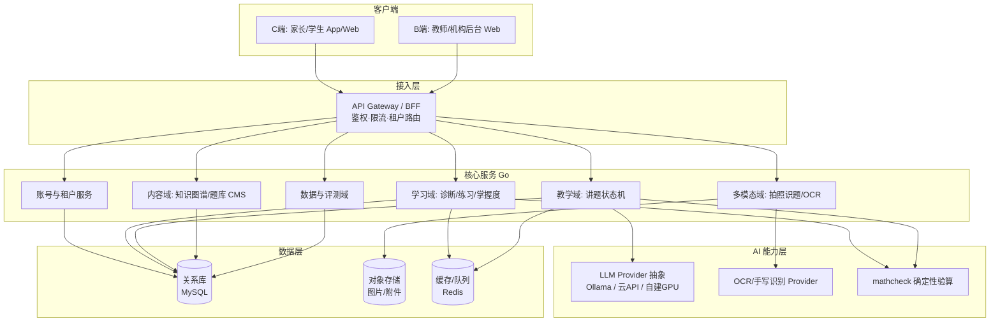

# 全龄段全学科 AI 学习平台 路线图

> 本文档承接 [`docs/plan.md`](plan.md)（MVP 设计）。MVP 已跑通三层闭环，本文档规划「如何做成完整项目」。

---

## 0. 一句话总纲

> 把已验证的「诊断 → 教学 → 练习」单机原型，建成一个**学段无关、学科无关的可泛化学习平台内核**，再沿四条主线工程化：**① 内容规模化（可插拔的知识图谱 + 内容生产线）、② 账号与多租户（C 端家庭 / B 端机构）、③ 多模态（拍照识题 OCR）、④ 平台工程化（可观测、可部署、可测试的私有化交付）**。北极星是全龄段全学科，但**执行上永远"先做透一个楔子，再一环环扩"**。

---

## 0.5 北极星愿景 vs 落地纪律（全龄段全学科怎么不被拖死）

**愿景**：覆盖 幼儿园 → 小学 → 初中 → 高中 → 大学 → 职业教育 → 成人教育 → 老年教育 的全学段 × 全学科。

**核心判断（务必内化）：**
1. **引擎可泛化，但"判分/教法/UX"随学段学科剧变。** 知识追踪(BKT)、苏格拉底引导、间隔重复(FSRS)这套**引擎天然跨学段学科通用**；但"什么算答对"（数学可确定性判分，语文作文/职业技能不行）、"用什么教法"、"面向 6 岁还是 60 岁的交互"差异巨大。**离结构化、可判分的知识越远，你现有引擎的差异化越弱，越退化成"通用 LLM 家教 + 内容生意"**——这是必须正视的护城河衰减。
2. **只为"可泛化"投资架构，不为"全都做"投资人力。** 架构层把学段/学科/判分/教法都抽象成可插拔策略（见 §3.6）；但内容与 GTM 永远聚焦当下这一"环"。
3. **先扎楔子，再扩环。** 楔子 = 你已验证、差异化最强的地方：**K12 数学**（结构化、可判分、知识图谱清晰、苏格拉底有效）。

**建议扩展环（由内到外，差异化由强到弱）：**

| 环 | 范围 | 为何这个顺序 | 判分/教法形态 |
|----|------|-------------|--------------|
| 楔子 | K12 数学 | 已有资产 + 差异化最强 | 确定性判分 + 苏格拉底 |
| 环 1 | K12 理科（物理/化学/生物）| 结构化、可判分，迁移成本低 | 确定性/半确定性 + 苏格拉底 |
| 环 2 | K12 语言（语文/英语）| 用户重叠高，但判分需换范式 | 规则校验 + rubric/LLM 评分 |
| 环 3 | 高中→大学/考研/考证 | 目标驱动、付费力强 | 题库 + 项目/证书导向 |
| 环 4 | 职业教育 / 成人技能 | 标准化考证可判分；技能类靠项目 | 考点判分 + 实操 rubric |
| 环 5 | 幼儿园 / 老年教育 | 交互范式完全不同，单列赛道 | 游戏化/陪伴，弱判分 |

> 幼儿园（无文字输入、家长主导、游戏化）与老年教育（陪伴、兴趣、无障碍 UX）与中间学段差异极大，**更像独立产品线**，不建议早期分散精力——放在最外环或作为平台开放给第三方内容方。

---

## 1. 现状评估（MVP 盘点）

### 已具备（可直接复用的资产）
- 三层引擎闭环：BKT 诊断、根因追溯、FSRS 间隔重复、苏格拉底四阶段讲题状态机。
- 确定性数学验算 `mathcheck`（先算后讲，LLM 不负责判对错）。
- `Store` 接口抽象已就位，业务层不直接依赖存储实现（换库零侵入的基础在）。
- 前端三层页面 + 公式输入/渲染（MathLive + KaTeX）。
- 降级策略：Ollama 不可用时回退模板提示。

### MVP 级、撑不到完整产品的点（需重构/替换）
| 维度 | 现状 | 完整产品要求 |
|------|------|-------------|
| 账号 | 无登录，单设备多档案 | 家长/学生/教师/机构多角色账号 + 鉴权 |
| 多租户 | 无租户概念 | C 端「家庭」、B 端「机构 → 班级 → 学生」隔离 |
| 存储 | `JSONStore` 全局锁、整文件覆写 | 关系库（学习数据）+ 对象存储（图片）+ 缓存 |
| 内容 | 单学科 60 题硬编码 JSON | 多学科知识图谱 + 题库 CMS + 内容生产线 |
| LLM | 硬编码本地 Ollama | Provider 抽象（Ollama / 云 API / 自建 GPU 可切换） |
| 多模态 | 无 | 拍照识题（手写体公式 OCR + 题目切分） |
| 部署 | 本地 `go run` + `vite dev` | 容器化、可私有化交付、可观测 |
| 配置 | CORS / 端口硬编码 localhost | 环境分层配置（dev/staging/prod/on-prem） |
| 质量 | 引擎层有单测，API 层无 | API 集成测试 + E2E + CI 流水线 |

---

## 2. 目标架构总览



**设计原则（延续 MVP 并强化）：**
1. **学习闭环不依赖 LLM**：诊断/练习/判分全部确定性，LLM 只做教学引导。保证私有化、低算力环境也能用。
2. **能力 Provider 化**：LLM、OCR 都抽象成接口，按部署画像注入不同实现，不锁死供应商。
3. **领域边界清晰**：账号、学习、教学、内容、多模态、分析各成模块，先单体多模块（modular monolith），需要时再拆服务。
4. **私有化优先，云为超集**：单二进制 + 容器能在机构内网跑通全功能；云端只是加上水平扩展与托管 GPU。

---

## 3. 关键架构决策（这些先定，后面少返工）

### 3.1 部署画像（Deployment Profile）——调和"私有化 + C/B 双模式"
用一套代码、三种部署画像：

| Profile | 面向 | 存储 | LLM | OCR | 说明 |
|---------|------|------|-----|-----|------|
| `dev` | 本地开发 | SQLite/JSON | **本地 Ollama（零成本快速迭代）** | 本地小模型/关闭 | 单二进制即开即用，离线可跑 |
| `cloud` | C 端家庭（正式产品） | 你的私有云 MySQL | **云 API LLM（通义/DeepSeek 等）** | 云 OCR | 多租户，主力线上形态 |
| `onprem` | B 端机构（私有化售卖） | 机构内 MySQL | 机构内 Ollama/GPU 或机构指定云 | 机构内 OCR | 数据不出机构内网，按合同选 LLM |

通过 `DEPLOY_PROFILE` + 配置文件选择各 Provider 实现。**LLM 走"开发期 Ollama → 正式产品云 API"的演进路径，Provider 抽象让切换零业务改动**；onprem 是 B 端私有化的可选交付形态（机构若要求数据不出网，仍可回落本地模型）。

### 3.2 单体优先，而非一上来微服务
- 阶段性：**先做 modular monolith**（一个 Go 进程，内部按域分包），私有化交付简单、运维成本低。
- 仅当某域出现独立扩展需求（如 OCR 吃 GPU、讲题并发高）时再拆出独立服务。
- 目录从 `internal/<域>` 演进，模块边界现在就划清楚。

### 3.3 存储选型
- **关系库**：MySQL 8.x（你 MVP 已预生成 `migrations/001_schema.mysql.sql`，schema 一脉相承，零重设计成本）。8.x 的 JSON 字段类型可承载 `solution_steps`/`hints` 等半结构化内容；全文检索用 `FULLTEXT`（ngram 解析器支持中文）或后续接 ES。
- **对象存储**：图片/附件用 S3 兼容（MinIO 可私有化部署，满足 onprem）。
- **缓存/队列**：Redis（会话、限流、OCR 异步任务）。
- `Store` 接口已抽象 → 新增 `MySQLStore` 实现（`mysql_store.go` 已占位），逐步替换 `JSONStore`（保留 `dev` 画像用）。建议用 `sqlc`（编译期类型安全、贴近原生 SQL）或 GORM；多租户场景注意所有查询带 `tenant_id` 条件。

### 3.4 LLM Provider 抽象（开发期 Ollama → 正式产品云 API）
**明确策略**：开发/调试期用本地 Ollama（免费、可离线、迭代快）；正式产品切云 API LLM（质量更稳、免自建 GPU 运维）。两者通过同一接口切换，**业务代码零改动**。

```go
type LLMProvider interface {
    Chat(ctx, messages, opts) (stream, error)
    Healthy(ctx) bool
    Name() string
}
// 实现：
//   OllamaProvider       —— 开发期默认（LLM_PROVIDER=ollama）
//   OpenAICompatProvider —— 正式产品（LLM_PROVIDER=openai_compat），
//                           兼容通义千问/DeepSeek/Moonshot 等 OpenAI 协议端点
```

切换只靠环境变量/配置：`LLM_PROVIDER` + `LLM_BASE_URL` + `LLM_API_KEY` + `LLM_MODEL`。

**演进时需补齐的产品化细节（云 API 比本地 Ollama 多出的关注点）：**
- **密钥管理**：API Key 走密钥管理（不入库、不进 git），按租户/环境隔离。
- **成本控制**：按场景路由模型（诊断报告用便宜小模型、难题讲解用强模型）；prompt/历史裁剪；必要时缓存。
- **限流与重试**：云端有 RPM/TPM 配额，需限流、退避重试、熔断降级。
- **降级链**：云 API 故障 → 备用供应商 → 模板提示（学习闭环本就不依赖 LLM，体验不中断）。
- **数据合规**：云 API 会把对话发到第三方，未成年人数据需脱敏；B 端私有化场景按合同回落本地模型。
- **可观测**：记录 token 用量、首字延迟、失败率，支撑成本与质量分析。

### 3.5 账号与租户模型
```
Tenant(租户: 家庭 or 机构)
  └─ Org 可选(机构) ─ Class(班级)
  └─ User(家长/教师/管理员, 有登录凭证)
  └─ LearnerProfile(学生学习档案, C 端可由家长创建, B 端由教师/导入创建)
```
- 所有学习数据（mastery/attempts/sessions）挂 `tenant_id` + `learner_id`，行级隔离。
- 鉴权：JWT（access + refresh）；B 端支持 RBAC（管理员/教师/学生）。
- `LearnerProfile` 不绑死"学生"概念——**任意年龄学习者**（幼儿/中小学生/大学生/职场人/银发族）皆为 learner，附 `stage`（学段）属性驱动差异化 UX 与教法。

### 3.6 可泛化内核：学段/学科/判分/教法 都做成可插拔策略（支撑全龄段全学科的关键）
全龄段全学科**不能靠堆 if-else**，而是把"随学段学科剧变"的部分抽象成接口，内核只依赖接口：

```go
// 学科/领域：数学、语文、英语、物理、考证科目……每个领域注册自己的能力
type Domain interface {
    ID() string                 // "math.k12" / "chinese.k12" / "cert.cpa" ...
    KnowledgeGraph() Graph      // 该领域的微技能图谱
    Assessor() Assessor         // 判分策略（见下）
    Pedagogy() []Strategy       // 可用教法（苏格拉底/精讲/项目/陪伴…）
}

// 判分策略：这是跨学科最大的分叉点
type Assessor interface {
    // 返回是否正确 + 结构化反馈；不同实现差异巨大：
    Assess(ctx, question, answer) (Result, error)
}
// 实现谱系（按确定性递减）：
//   DeterministicAssessor —— 数学/理科：符号验算，唯一真值（现有 mathcheck）
//   RuleAssessor          —— 字词默写/语法点：规则/精确匹配
//   RubricLLMAssessor     —— 作文/简答/开放题：评分量规 + LLM 评分 + 置信度
//   ProjectAssessor       —— 职业技能/实操：作品提交 + 人工/同伴/AI 复合评审
//   InteractionAssessor   —— 幼儿/老年：以参与度/正确反馈替代严格判分
```

- **知识追踪（BKT）、间隔重复（FSRS）、苏格拉底状态机** 留在内核，对所有 Domain 通用。
- 新增一个学科/学段 = 注册一个 `Domain` + 配一套判分/教法策略 + 灌内容，**不改内核**。
- 这层抽象就是"愿景全龄段全学科、但只为可泛化投资架构"的落地点。

---

## 4. 分阶段路线图

> 你选了"先给理想完整路线"，所以这里按**能力成熟度**分阶段而非死时间表。每阶段可独立交付价值。

### Phase A — 平台地基（让 MVP 变"可多人用"）
**目标：从单机原型变成有账号、可多租户、有真数据库的服务。**
- [ ] 引入 MySQL 8.x，实现 `MySQLStore`（基于已有 `001_schema.mysql.sql` 扩展），所有表加 `tenant_id`/`learner_id`。
- [ ] 账号与租户服务：注册/登录、JWT、角色（家长/学生/教师/管理员）。
- [ ] API Gateway/BFF 层：鉴权中间件、租户路由、限流、统一错误码。
- [ ] 配置分层（dev/staging/prod/onprem）+ 去除 localhost 硬编码（CORS/端口/Ollama 地址）。
- [ ] 容器化：后端、前端、MySQL、Redis、MinIO 一套 `docker-compose`；Helm/compose 两种交付物。
- [ ] CI 流水线：lint + 单测 + 构建镜像。
- **验收**：两个家庭/两个机构的数据互不可见；重启不丢数据；一条命令私有化拉起。

### Phase B — 内容规模化与 Domain 框架（全学科的真正壁垒）
**目标：从"60 题硬编码"到"可持续生产的多学科知识图谱 + 题库"，并把 §3.6 的 Domain/Assessor 可插拔框架落地。**
- [ ] 落地 `Domain` / `Assessor` / `Pedagogy` 可插拔框架（§3.6），内核与具体学科解耦。
- [ ] 知识图谱 schema 升级：支持多学科、多学段（`stage`）、跨单元前置依赖；微技能粒度规范，图谱可按 Domain 独立维护。
- [ ] 题库/内容 CMS：增删改查后台（内容团队/B 端教师用），内容 ↔ 微技能打标、难度标定、分步解、提示；支持非题目型内容（讲解、项目、素材）。
- [ ] 多种判分策略落地：`Deterministic`（数学/理科，扩展现有 `mathcheck`）、`Rule`（字词/语法）、`RubricLLM`（作文/开放题）先各出一个可用实现。
- [ ] 内容生产线：LLM 辅助生成 → 确定性/规则校验 → 人工终审，全程留痕可回滚。
- [ ] 内容版本管理（变更可追溯、可灰度）。
- **按"环"推进**：先把楔子 **K12 数学**做透并沉淀生产线，再用同一框架复制到环 1（理科）、环 2（语言）……每扩一环只新增 Domain + 内容，不改内核。
- **验收**：新增一个学科/学段，无需改内核代码，注册 Domain + 灌内容即可上线。

### Phase C — 多模态：拍照识题（你的高优先项）
**目标：家长拍一张作业照片 → 自动切题 → 识别（含手写/公式）→ 进入诊断/讲题闭环。**
- [ ] 上传链路：图片上传到对象存储（MinIO/S3），异步任务队列（Redis）处理。
- [ ] 题目切分：版面分析，把整页作业切成单题（可先用成熟版面分析模型/服务）。
- [ ] OCR + 公式/手写识别：`OCRProvider` 抽象（云：通用/教育 OCR；onprem：自部署如 PaddleOCR/RapidOCR + 公式识别模型）。
- [ ] 识别结果纠错：结构化为题干 + 学生作答，关键步骤让用户确认（识别不确定时给可编辑预览）。
- [ ] 与现有 `mathcheck` 对接：识别出的作答走确定性判分 → 错题进诊断/讲题。
- **验收**：拍一页手写分数作业，能正确切出≥80% 题目并进入讲题；识别不准时有可编辑兜底。

### Phase D — 数据与评测闭环（产品护城河 + 商业证据）
**目标：用数据证明"真的有效"，同时反哺内容与算法。**
- [ ] 学习行为埋点与事件流（答题、提示使用、讲题轮次、停留时长）。
- [ ] 效果度量：掌握度提升曲线、单元通过率、复习依从率；班级/家庭维度报表。
- [ ] B 端教师看板：班级薄弱点热力图、个体根因链、作业完成度。
- [ ] C 端家长报告：周报（孩子掌握了什么、卡在哪、建议练什么）。
- [ ] 算法迭代支撑：BKT 参数按学科/技能拟合、FSRS 个性化、讲题 prompt A/B 实验框架。
- **验收**：能产出一份可信的"使用前后掌握度对比"报告（为 RCT/招商/融资背书）。

### Phase E — 增长与商业化
**目标：把产品能力变成可售卖、可运营的形态。**
- [ ] C 端：订阅/会员、家长支付、试用转化、消息触达（练习提醒、周报推送）。
- [ ] B 端：机构开通/计费、教师批量导入学生、作业布置与回收、私有化授权与许可。
- [ ] 合规：未成年人隐私保护（数据最小化、家长同意）、内容安全审核、等保（B 端常要求）。
- [ ] 运营后台：内容/用户/订单/反馈一体化。

---

## 5. 专题深入

### 5.1 全学科全学段内容（最重的工程，也是护城河所在）
- 知识图谱与内容是核心资产，但**生产成本随"环"外移急剧上升**：越靠近开放性学科（作文、职业技能、兴趣），越无法自动化判分、越依赖人工与专家。**这正是要"先扎楔子再扩环"的根本原因**。
- **判分范式随学科剧变**（对应 §3.6 的 `Assessor`）：数学/理科 = 确定性验算；字词/语法 = 规则/精确匹配；作文/简答/开放题 = rubric + LLM 评分 + 置信度（低置信转人工）；职业实操 = 项目/作品复合评审；幼儿/老年 = 以参与度替代严格判分。**不要试图用一套判分逻辑硬套所有学科。**
- **教法也随学段变**：中小学苏格拉底引导有效；大学/考证更要"精讲 + 刷题 + 真题"；职业教育重项目实战；幼儿重游戏化；老年重陪伴与无障碍。教法做成 `Pedagogy` 策略按 Domain 选用。
- 内容生产是**人 + AI 协作**：LLM 草拟 → 确定性/规则校验 → 学科专家终审，全程留痕可回滚。规模化后可引入"第三方/机构共建内容"的开放平台模式（尤其外环学段，自营不划算）。
- **务实建议**：自营内容只覆盖差异化最强的内环（K12 数学/理科）；外环（成人/老年/小众职教）优先走**开放内容平台 + 合作方**，把平台能力变现而非自己生产所有内容。

### 5.2 私有化交付（B 端关键卖点）
- 交付物：单 compose / Helm chart，内含 MySQL + Redis + MinIO + Ollama，**离线可装**（镜像离线包）。
- LLM 在 onprem 用 Ollama 或机构自有 GPU（vLLM/OpenAI 兼容）；OCR 用可私有化的开源模型。
- 许可证红线：SocraticMath 数据集 CC BY-NC 4.0（非商用）——**商用前必须移除其数据依赖，仅可借鉴策略思想**；自建商用数据集或采购合规数据。

### 5.3 LLM 与成本/质量（开发期 Ollama → 正式产品云 API）
- **演进路径**：开发期本地 Ollama 把讲题逻辑/prompt 调顺；正式上线切云 API LLM 拿稳定质量。Provider 抽象保证切换只改配置。
- **切换前必须做的准备**（否则上线即踩坑）：密钥管理、按场景模型路由（省钱）、限流/重试/熔断、降级链（云故障→备用→模板）、token 用量与延迟可观测。
- **质量回归集**：建一套"讲题护栏回归集"（不泄露答案、不超纲、每次只问一个问题、用小学语言）。**这套回归集是 Ollama→云 API 平滑切换的安全网**——换模型/改 prompt 前后都自动跑，对比通过率，避免线上质量回退。
- **成本意识**：云 API 按 token 计费，C 端规模化后是主要变动成本；诊断/报告类用便宜模型、难题讲解用强模型，并裁剪历史上下文。

### 5.4 工程化与质量
- 测试金字塔：引擎单测（已有）→ API 集成测试（补）→ 关键流程 E2E（诊断/讲题/拍照）。
- 可观测：结构化日志 + 指标（首字延迟、判分耗时、OCR 成功率）+ 链路追踪。
- 数据迁移：`cmd/migrate` 从 JSON → MySQL（runtime/*.json 一次性导入）；后续 schema 变更用迁移工具（如 golang-migrate，支持 MySQL）做版本化管理。

---

## 6. 建议的起步顺序（务实路径）

愿景是全龄段全学科，但**绝不一次性铺开**。建议这样切入：

1. **先 Phase A 地基**（账号 + MySQL + 多租户 + 容器化）——没有它，C/B 双模式无从谈起。
2. **并行启动 Phase B**：先落地 §3.6 的 Domain/Assessor 框架，再把**楔子（K12 数学）**内容做透、沉淀生产线。框架就位后，扩学科只是"注册 Domain + 灌内容"。
3. **再上 Phase C 拍照识题**（依赖 A 的上传/存储与 B 的题库匹配）。
4. **Phase D 数据闭环**贯穿始终，A 阶段就埋点。
5. **按"环"逐步扩学科学段**（环1理科 → 环2语言 → 环3大学/考证 → 环4职教 → 环5幼儿/老年），**每环达标再扩下一环**；外环优先合作/开放内容。
6. **Phase E 商业化**在有稳定 C 端留存后再压上。

---

## 7. 风险与应对

| 风险 | 应对 |
|------|------|
| **贪大求全，全学段全学科一起铺 → 处处浅尝、护城河被摊薄** | **最高优先级风险**：北极星归北极星，执行严守"先扎楔子(K12数学)再扩环"；每环验收达标才扩下一环；外环优先合作/开放平台而非自营 |
| 外环学科（作文/职教/兴趣）无法确定性判分、差异化退化为通用 LLM 家教 | 用 §3.6 可插拔 `Assessor`（rubric/LLM/项目评审）；差异化重心守在可判分的内环；外环靠内容生态而非算法 |
| 全学段 UX 差异大（幼儿 vs 老年）一套界面满足不了 | `LearnerProfile.stage` 驱动差异化前端；幼儿/老年作为独立产品线或最外环，不早期分散精力 |
| 多学科内容生产慢、成本高 | 先数学做深做透沉淀生产线，再横向复制；LLM 辅助 + 人工审核；外环引入第三方共建 |
| 私有化与多租户 SaaS 双形态维护成本 | 一套代码 + 部署画像，差异收敛到 Provider 与配置层 |
| 拍照手写识别准确率不足 | 识别结果可编辑兜底 + 关键步骤人工确认；切题与识别分阶段验收 |
| 非商用数据集合规风险 | 商用前移除 SocraticMath 数据依赖，自建/采购合规数据 |
| 私有化环境算力有限，大模型跑不动 | 学习闭环不依赖 LLM；讲题支持小模型降级与模板兜底 |
| 未成年人隐私合规 | 数据最小化、家长同意、可私有化（数据不出机构）天然合规友好 |

---

## 8. 里程碑判定（每阶段"算完成"的硬标准）

- **A 完成**：多租户隔离 + 登录 + MySQL 持久化 + 一键私有化部署，回归三层闭环通过。
- **B 完成**：Domain/Assessor 框架就位 + 楔子(K12 数学)覆盖到位；纯内容后台即可注册新 Domain/上线新学科，不改内核。
- **每扩一环完成**：新学段/学科以独立 Domain 上线、有对应判分策略、关键学习指标达标，方可扩下一环。
- **C 完成**：拍一页手写作业能切题 + 识别 + 进入讲题，识别有可编辑兜底。
- **D 完成**：产出可信的"使用前后掌握度对比"报告。
- **E 完成**：C 端可付费订阅、B 端可开通计费并私有化授权。
